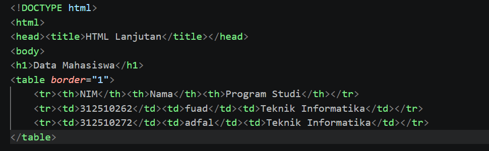

# Lab2Web

# Praktikum 2: HTML Lanjutan - Pemrograman Web

Repository ini dibuat untuk menyelesaikan tugas Praktikum 2 Pemrograman Web.  
  
Nama : Fuad Muhammad Adfal 
NIM : 312510262  
Kelas :I251A  
Mata Kuliah : Pemrograman Web  

## Langkah-Langkah Praktikum

### 1. Membuat Tabel Data Mahasiswa

Pada langkah ini, kita membuat tabel dasar menggunakan elemen `<table>`, `<tr>`, `<th>`, dan `<td>` dengan atribut `border="1"` untuk menyajikan data mahasiswa ke dalam bentuk baris dan kolom.

### 2. Mengembangkan Tabel dengan `thead`, `tbody`, dan `tfoot`

Menyusun struktur tabel yang lebih kompleks dan rapi dengan membaginya ke dalam bagian kepala (`<thead>`), badan (`<tbody>`), dan kaki tabel (`<tfoot>`), serta menggunakan elemen `<caption>` dan atribut `colspan` untuk menggabungkan sel.

### 3. Membuat Form Registrasi Mahasiswa

Membuat form interaktif menggunakan elemen `<form>` beserta elemen input standar seperti teks, email, password, dan tanggal lahir (`type="date"`), dilengkapi tombol submit dan reset.

### 4. Radio Button dan Checkbox

Menambahkan elemen pilihan lanjutan berupa *radio button* (`type="radio"`) untuk pilihan tunggal (seperti jenis kelamin) dan *checkbox* (`type="checkbox"`) untuk pilihan ganda (seperti keahlian).

### 5. Select dan Textarea

Menambahkan elemen dropdown pilihan menggunakan `<select>` dan `<option>`, serta kotak teks multi-baris menggunakan `<textarea>` untuk alamat.

### 6. Validasi Form Dasar

Menerapkan atribut validasi bawaan HTML seperti `required`, `minlength`, `min`, dan `max` pada elemen form untuk memastikan input pengguna valid sebelum dikirim.

### 7. Membuat Halaman Semantic HTML

Menyusun struktur tata letak halaman web yang lebih bermakna dan terstandar menggunakan elemen semantik seperti `<header>`, `<nav>`, `<main>`, `<section>`, `<article>`, `<aside>`, dan `<footer>`.

### 8. Menambahkan Multimedia

Menyisipkan file media berupa audio (`<audio>`) dan video (`<video>`) ke dalam halaman web dengan kontrol pemutaran (`controls`) serta mengambil sumber file dari folder `media/`.

### 9. Proyek Mini: Form Biodata Mahasiswa

Menggabungkan seluruh materi yang telah dipelajari—meliputi struktur semantik, tabel data, form registrasi lengkap dengan validasi, hingga elemen multimedia—kedalam satu halaman web proyek mini (`biodata.html`).

